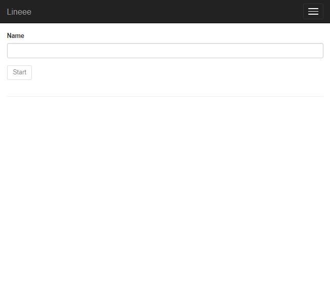
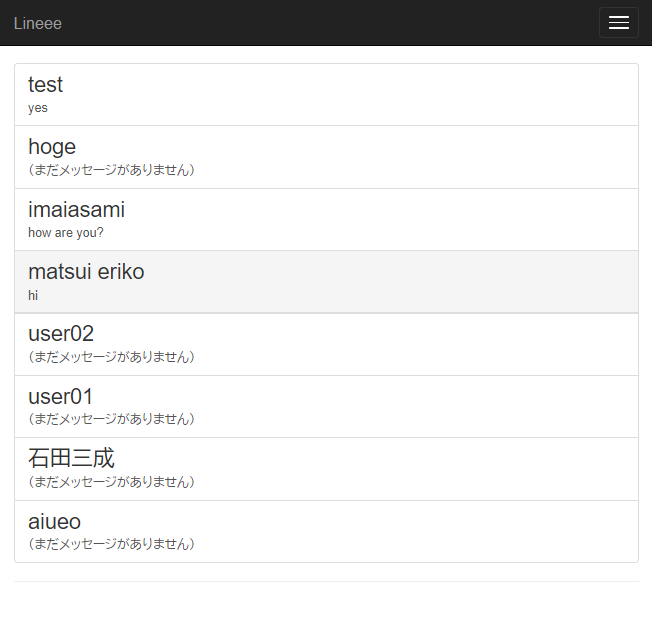
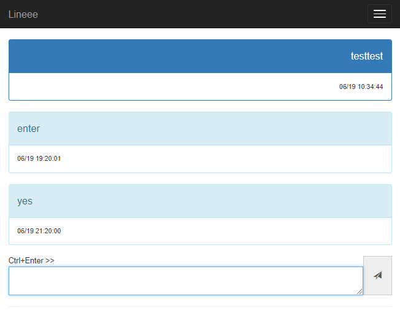
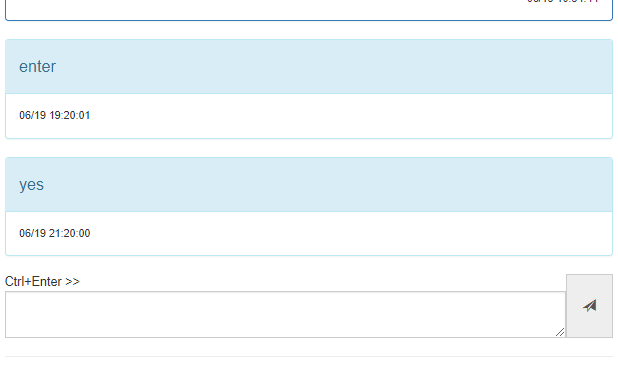

LINE風Webアプリ
====

LINE風のトーク機能を提供するサーバーを作成しました。使用言語はC#・フレームワークはASP.NET Coreです。

マルチプラットフォームに対応するフレームワークの特長により、Windows・Mac・Linuxのいずれでも（理論上は）サーバーを開設できます。

ログイン処理・既読の有無などで機能がかなり簡略化されていますが、直感的に操作できるUIを目指しました。

## Usage

上記の通りマルチプラットフォームで動作するのが理想ですが、Windowsのみでしかテストしていません。

Windows上で発行済みの実行可能プロジェクト"freee-line/Released/win-x64.zip"を展開し、"Lineee.exe"を実行すればサーバーが立ちます。デフォルトでは5000番ポートが開きますが、"hosting.json"の番号部分を編集すればポート番号を変更できます。

ソースからビルドする場合、[.NET Core 2.0](https://www.microsoft.com/net/download/all)をインストールする必要があります。

## UI

### ログイン

使用する名前を入力します。データベースにない名前の場合は新たにアカウントを作成します。

### トーク相手の選択

データベースに存在するアカウントが一覧表示されます。トークしたい相手を選択します。

### トークルーム

今までの発言の一覧と、メッセージの入力フォームが表示されます。

SNSの入力でよくある「Enterが改行なのか送信なのか分からない問題」を少しでも解消しようと、"Ctrl+Enter >>"のラベルがCtrlキー押下時に変化するようにしました。

